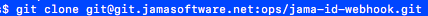
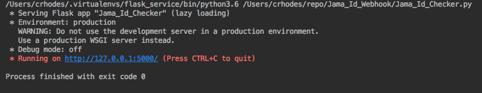
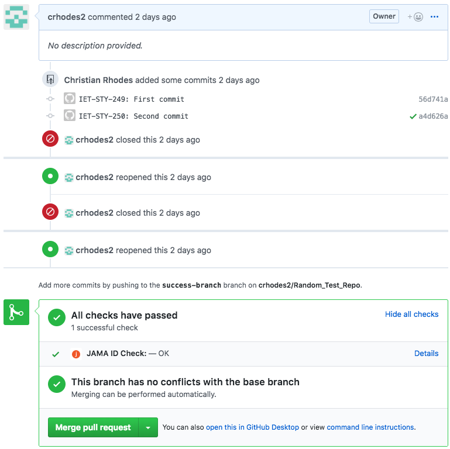
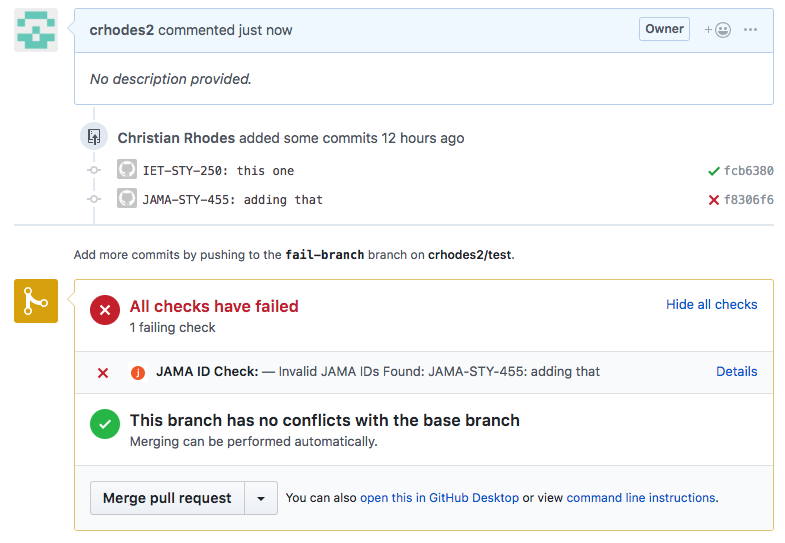

# JAMA ID Checker

## QUICK INTRO:

JAMA ID Checker is a web application developed for JAMA Software, 
integrated with GitHub and runs under the Flask Server module. 
The application is intended to automate the manual labor of bidirectional traceability; 
allowing users to check for the inclusion of JAMA’s validation signatures called a JAMA ID. 
The program was written in Python.

You must be familiar with GitHub, GitLab, and using Git in your command line terminal to be able to use
the program.

## HOW TO INSTALL AND GET STARTED WITH JAMA ID CHECKER:

First, export this program into your directory.

Start by reading this guide below to get started:

https://jamasoftware.jiveon.com/docs/DOC-11468

This guide will have had you set up a python virtual environment with Flask and GitHubAppSession.

You will need to export the following environment variables on your machine:

+ APP_ID = The application ID from GitHub. 
+ PK = The contents of the .PEM file from GitHub
+ CLIENT_ID = JAMA OAuth client ID
+ CLIENT_SECRET = JAMA OAuth client Secret

These variables need to be stored within the JAMA ID Checker directory as possibly a plain text file, or an .env file.

## HOW TO RUN APPLICATION?: 

Go to your terminal, go to the directory where you've downloaded the application, go into that folder, 
and copy and paste the following command:

> PK=$PK APP_ID=$APP_ID CLIENT_ID=$CLIENT_ID CLIENT_SECRET=$CLIENT_SECRET FLASK_APP=Jama_Id_Checker flask run

You should be able to see this screenshot:

If you don't see this in your terminal, it means you have not properly exported your environment variables on your machine.
You will need to do so before continuing on from this point.

## TO DEPLOY THE PROGRAM IN AWS (AMAZON WEB SERVICES), FOLLOW THIS GUIDE BELOW:
https://jamasoftware.jiveon.com/docs/DOC-11647

## MAKING IT WORK...

If you have followed the **HOW TO RUN APPLICATION** section carefully, the application should've been downloaded and installed
within the same directory as your own program code repositories. (ie. if your program codes are in a folder called *myPythonApp*,
then the JAMA ID Checker application should be in that same folder)

The program's purpose is to automate the validating of commit messages in a pull request on any repository.
If your repository directory sits in the same directory as the JAMA ID Checker, and the Python environment variables are set
along with it, you will be able to run the program from your repository.

Here are the steps: 

+ Make some changes to your code, then commit and push your code to your repository using git commands.
+ Go to GitHub to create a Pull Request or a Merge Request respectively.

You can also double-check your repository on GitHub.
 
For GitHub, simply go to *https://github.com/user/repo/*, and click Pull Requests. 

*user* being your username and *repo* being your repository name

Once your Pull Request has been created, your terminal will run with the results based on your own commit messages
in your Pull Requests. You should be expecting either one of these screenshots.

A **Successful** Jama ID Check means all commit messages have JAMA ID included in Jamaland.

A **Failure** Jama ID Check means not all commit messages have JAMA ID included in Jamaland 
or are invalid and do not exist.

                                            <--->

